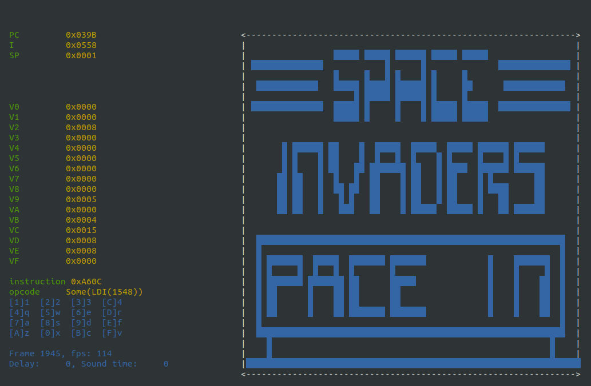

Chip-8 emulator written in Rust language.

This emulator is using [my libchip8](https://github.com/kamchy/libchip8.git) library.
This is just a learning excercise to familiarize a bit with language syntax and tooling.
The shot below is taken when running _Space Invaders_ rom from great [dmatlack repository](https://github.com/dmatlack/chip8.git).

